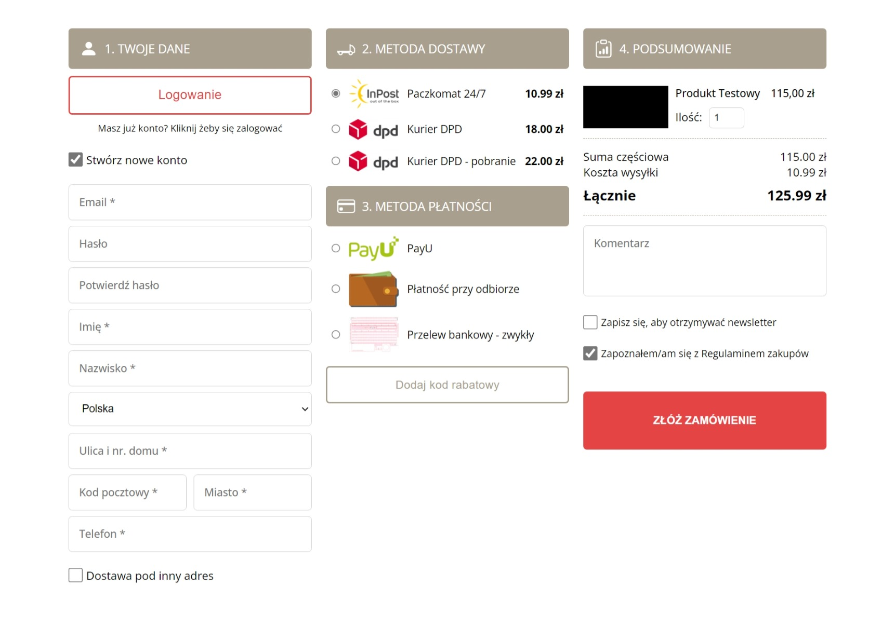

# Getting Started with Create React App

This project was bootstrapped with [Create React App](https://github.com/facebook/create-react-app).

This project uses also PHP with MySQL to store orders in database.

## Available Scripts

### Front-End:

In the project directory, you can run:

### `yarn start`

### Back-End:

For backend, download XAMPP and put the server files into xampp/htdocs and run in control panel XAMPP and APACHE server. Then import smartshop.sql file into your local phpmyadmin panel.

By default App.js file sends data to [http://localhost/shop-order-form/](http://localhost/shop-order-form/).

Runs the app in the development mode.\
Open [http://localhost:3000](http://localhost:3000) to view it in the browser.

#### Project Screenshoot
